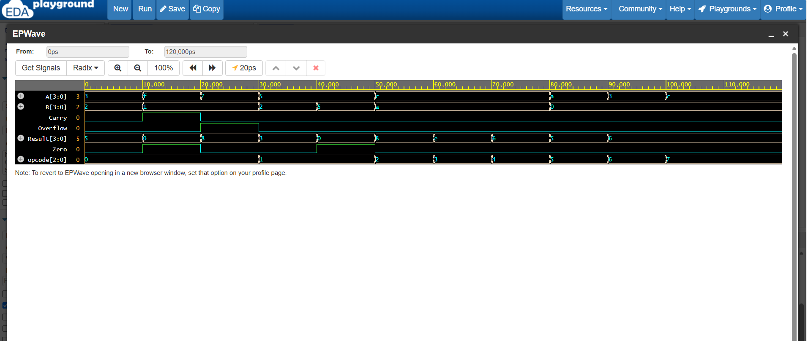

# 4-Bit ALU Design and Functional Verification using Verilog RTL

## Overview

Designed and functionally verified a 4-bit Arithmetic Logic Unit (ALU) using synthesizable Verilog RTL.

The ALU accepts two 4-bit operands and a 3-bit opcode and performs eight arithmetic and logical operations. The design also generates Carry, Zero, and signed Overflow status flags.

## ALU Operations

| Opcode | Operation |
|--------|-----------|
| 000 | Addition |
| 001 | Subtraction |
| 010 | AND |
| 011 | OR |
| 100 | XOR |
| 101 | NOT |
| 110 | Left Shift |
| 111 | Right Shift |

## Features

- 4-bit ALU design using Verilog RTL
- Eight arithmetic and logical operations
- Carry flag generation
- Zero flag generation
- Signed Overflow detection
- Synthesizable combinational RTL
- Self-checking Verilog testbench
- Reusable verification task
- Functional and corner-case testing
- Waveform-based verification using EPWave

## Design Inputs and Outputs

### Inputs

| Signal | Width | Description |
|--------|-------|-------------|
| A | 4-bit | First operand |
| B | 4-bit | Second operand |
| opcode | 3-bit | Selects the ALU operation |

### Outputs

| Signal | Width | Description |
|--------|-------|-------------|
| Result | 4-bit | ALU operation result |
| Carry | 1-bit | Indicates carry generation during addition |
| Zero | 1-bit | Indicates when the result is zero |
| Overflow | 1-bit | Indicates signed arithmetic overflow |

## Verification

A self-checking Verilog testbench was developed to verify the ALU functionality.

The testbench uses a reusable task to apply different input combinations and opcodes and observe the resulting outputs and status flags.

### Test Cases

The following operations and corner cases were verified:

- Basic addition
- Addition with carry
- Addition with signed overflow
- Subtraction
- Subtraction producing zero
- AND operation
- OR operation
- XOR operation
- NOT operation
- Left shift
- Right shift

## Waveform Verification

The ALU was simulated and the signals were analyzed using EPWave.

The waveform demonstrates the relationship between the input operands, opcode, ALU result, Carry, Zero, and Overflow flags during simulation.



## Project Structure

```text
4-bit-ALU-Verilog/
│
├── alu4.v
├── alu4_tb.v
├── alu_waveform.png
└── README.md
